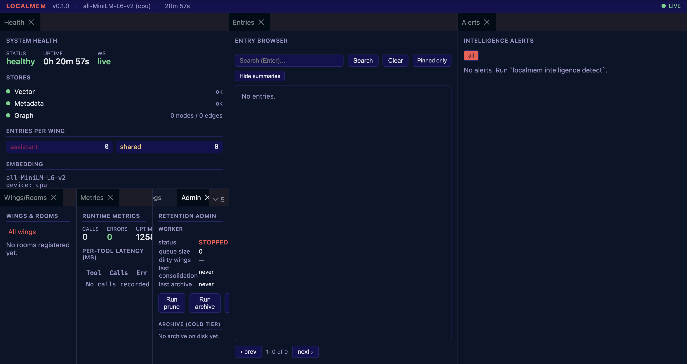

# localmem

[](https://pypi.org/project/localmem/)
[](https://pypi.org/project/localmem/)
[](LICENSE)
[](https://github.com/jordanaftermidnight/localmem/actions/workflows/ci.yml)

**Local-first multi-agent memory MCP server.** Persistent storage for LLM
agents — hybrid (dense + sparse) vector search, behavioral pattern graphs,
temporal knowledge triples, layered wake-up context, lifecycle management,
and a read-only browser dashboard. All on-device, no cloud dependencies.

Exposes its functionality over the Model Context Protocol (SSE transport), so
any MCP-capable client — Claude Code, Cursor, Continue, custom agents — can
read and write memory through a single shared server.

## Why

Most "memory" for LLM agents is either a flat key-value store or a
single-agent knowledge graph. Real agent systems need more:

- **Per-agent namespaces.** Each agent's notes, decisions, and observations
  stay in its own wing. A reserved `shared` wing carries cross-agent context.
- **Hybrid retrieval.** Dense embeddings catch semantic matches, sparse BM25
  catches exact terms, RRF fuses both. Either signal alone misses too much.
- **Behavioral graphs.** Some relationships live in entries; others live in
  the connections between them — co-occurrence, sequence, community structure.
- **Temporal knowledge.** Facts change. Knowledge triples track validity
  windows and surface contradictions automatically.
- **Graceful forgetting.** Three-tier lifecycle (hot → warm summaries →
  cold compressed archive) keeps the working set fast without losing history.
- **Token-aware loading.** Layered wake-up context (L0 manifest → L1 critical
  → L2 scoped search → L3 verbatim) gives an agent ~170 tokens of high-signal
  context without pulling the whole store.

## Quick start

> **Use a virtualenv.** Recent macOS / Homebrew / Debian Python installs are
> "externally managed" (PEP 668) and `pip install localmem` directly will
> refuse. A dedicated venv also keeps the `localmem` console script on `PATH`
> automatically when activated.

```bash
# 1. Create a venv (use Python 3.13 — 3.14 + Apple Silicon has a known
#    sentence-transformers shutdown issue, see Known issues below)
python3.13 -m venv ~/.venvs/localmem
source ~/.venvs/localmem/bin/activate

# 2. Install from PyPI
pip install 'localmem[dashboard,analytics]'

# 3. Scaffold a working config + data directory
mkdir -p ~/localmem-data && cd ~/localmem-data
localmem init --wing my_assistant --dashboard

# 4. Start the MCP server (SSE on http://localhost:8781)
localmem -c localmem.yaml serve
```

Connect any MCP client to `http://localhost:8781/sse` and the 22 tools below
become available.

**Dashboard (optional, read-only):**

```bash
# In another terminal (venv active):
localmem -c localmem.yaml dashboard            # REST + WS on http://localhost:8782

# The prebuilt React frontend isn't shipped on PyPI yet. To get the UI:
git clone https://github.com/jordanaftermidnight/localmem.git ~/localmem-source
cd ~/localmem-source/dashboard
npm install
VITE_API_URL=http://localhost:8782 VITE_WS_URL=ws://localhost:8782/ws npm run build
cd dist && python3 -m http.server 8785
```

Then open http://localhost:8785.

**Headless / always-on (macOS LaunchAgents):**

For a server that survives logout, reboot, and crashes, generate + load the
LaunchAgents in one command (after the Quick start above is working):

```bash
git clone https://github.com/jordanaftermidnight/localmem.git ~/localmem-source 2>/dev/null
python3 ~/localmem-source/deploy/setup-launchd.py --load
launchctl list | grep localmem
```

Three services come up: `com.localmem.serve` (:8781), `com.localmem.dashboard`
(:8782), `com.localmem.frontend` (:8785). All have `RunAtLoad=true` and
`KeepAlive=true` — they auto-start on login and respawn on crash. Combined
with Docker Desktop's "start on login" + `--restart unless-stopped` on the
Qdrant container (see [docs/DEPLOY.md](docs/DEPLOY.md) when written), the
stack runs entirely headless.

**Working from source (contributing or pinning a specific commit):**

```bash
git clone https://github.com/jordanaftermidnight/localmem.git
cd localmem
python3.13 -m venv .venv && source .venv/bin/activate
pip install -e '.[dev,dashboard,analytics]'
```

## MCP tools

| Group | Tool | Purpose |
| --- | --- | --- |
| Memory (6) | `localmem_store`, `localmem_search`, `localmem_retrieve`, `localmem_update`, `localmem_pin`, `localmem_unpin` | Entry CRUD + hybrid search |
| Graph (5) | `localmem_graph_add_node`, `localmem_graph_add_edge`, `localmem_graph_query`, `localmem_graph_neighbors`, `localmem_graph_communities` | Behavioral pattern graph |
| Knowledge (3) | `localmem_triple_assert`, `localmem_triple_query`, `localmem_triple_contradictions` | Temporal triples with contradiction detection |
| System (3) | `localmem_wake`, `localmem_health`, `localmem_metrics` | Layered wake-up + observability |
| Intelligence (3) | `localmem_intel_detect`, `localmem_intel_alerts`, `localmem_intel_report` | Pattern detection (opt-in via config) |
| Operations (2) | `localmem_prune`, `localmem_archive` | Retention triggers |

## Storage stack

- **[Qdrant](https://qdrant.tech/)** — embedded by default (path-backed,
  single-writer). Switch to a remote Qdrant via `storage.qdrant_mode: server`
  + `storage.qdrant_url` to unblock live embedding migrations and
  multi-process writers.
- **[NetworkX](https://networkx.org/)** — in-process directed multigraph with
  multi-hop traversal and Louvain community detection.
- **SQLite** (WAL) — temporal triples, agent diaries, wing/room taxonomy,
  importance scoring with time-decay.

## Configuration

`localmem.yaml` at the repo root is the single source of truth. The shipped
defaults run locally with zero edits — set `wings:` to name your agents and
you're done. See inline comments for every section. Highlights:

- `wings: [list]` — your agent namespaces. `shared` is implicit.
- `embedding.model` — `all-MiniLM-L6-v2` (384d, fast) or BGE-large (1024d,
  quality). Switch live with `localmem migrate-embeddings --to <model>`.
- `retention.enabled: true` — opt in to the three-tier lifecycle.
- `dashboard.auth_enabled: true` + bearer key for remote dashboard access.
- `intelligence.detectors.*` — each pattern detector is off until you point
  it at a specific wing/room (or node selector for the graph cluster
  detector). Nothing runs you didn't ask for.

Any string value supports `${VAR}` or `${VAR:-default}` env-var
interpolation, so secrets stay out of YAML on disk.

## Dashboard

A read-only browser UI under `dashboard/` (Vite + React + dockview). 10
panels: Health, Entries, Metrics, Alerts, Graph, Wings/Rooms, Triples,
Diaries, Logs, Admin. Pin/unpin and lifecycle triggers live in Admin.
Localhost-only by default; flip on bearer auth to expose it remotely.



## Observability

- `localmem health` and `localmem_health` MCP tool — per-wing entry counts,
  store connectivity, embedding device, retention worker status.
- `localmem_metrics` MCP tool — per-tool call counts, p50/p95/p99 latency,
  error counts (rolling window).
- `/metrics` Prometheus exposition endpoint on the dashboard sidecar (`text/plain;
  version=0.0.4`). See [docs/DASHBOARD.md](docs/DASHBOARD.md) for the metric
  reference and example scrape config.
- Structured logging (text or JSON) with optional `RotatingFileHandler`. See
  [docs/LOGGING.md](docs/LOGGING.md) for Loki + Promtail and ELK + Filebeat
  shipping configs.

## Deployment

`deploy/` contains installer scripts for the three major platforms — each
generates a config dir, sets up a service (systemd / launchd / Scheduled
Tasks), and writes an `api_key` to a perms-restricted env file:

```bash
deploy/setup-ubuntu.sh  --auth --qdrant-server http://qdrant:6333
deploy/setup-macos.sh   --auth
deploy/setup-windows.ps1 -Auth
```

## Documentation

- [`docs/ARCHITECTURE.md`](docs/ARCHITECTURE.md) — full specification
- [`docs/DASHBOARD.md`](docs/DASHBOARD.md) — dashboard panels, auth, metrics
- [`docs/LIFECYCLE.md`](docs/LIFECYCLE.md) — retention / consolidation / archive
- [`docs/MIGRATIONS.md`](docs/MIGRATIONS.md) — schema and embedding migrations
- [`docs/LOGGING.md`](docs/LOGGING.md) — log shipping recipes

## Project layout

```
localmem/
├── src/localmem/         # Package source
├── dashboard/            # React + dockview frontend
├── deploy/               # Installers + service units
├── docs/                 # Architecture, dashboard, lifecycle, migrations, logging
├── manifests/            # Per-agent wake-up manifests
├── tests/                # 300+ tests
├── localmem.yaml         # Default configuration
└── pyproject.toml
```

## Known issues

- **Python 3.14 + Apple Silicon + sentence-transformers**: the `loky`
  process pool used by sentence-transformers can crash silently at shutdown
  on Python 3.14 / arm64 macOS. Python 3.13 and earlier are unaffected.
  Either use Python 3.13 (verified end-to-end on this build) or switch to
  the sparse-only retrieval path via `embedding.model: "Qdrant/bm25"`.

## License

MIT. See [LICENSE](LICENSE).
